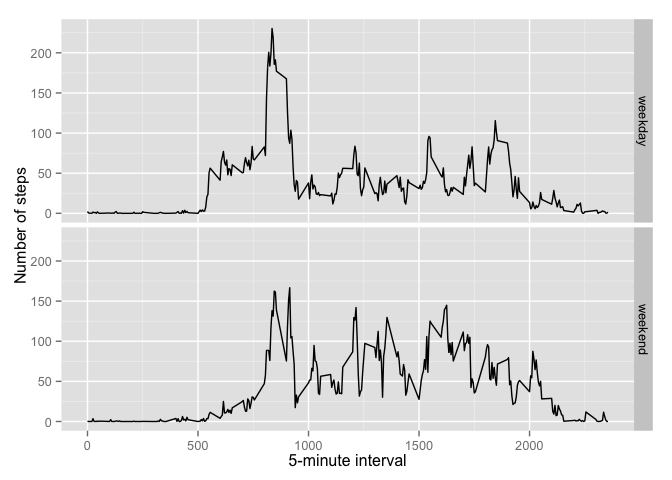

# Assignment Week 2
Stefan H.  
August 15, 2015  

## Loading and preprocessing the data

### Load data and convert date format


```r
if(!file.exists('activity.csv')){
     unzip('activity.zip')
}
Activity<-read.csv('activity.csv')
Activity$date <- as.Date(Activity$date)
str (Activity)
```

```
## 'data.frame':	17568 obs. of  3 variables:
##  $ steps   : int  NA NA NA NA NA NA NA NA NA NA ...
##  $ date    : Date, format: "2012-10-01" "2012-10-01" ...
##  $ interval: int  0 5 10 15 20 25 30 35 40 45 ...
```

## What is mean total number of steps taken per day?

### Calculate the total number of steps taken per day


```r
DailySteps <- aggregate(Activity$steps, list(Activity$date), FUN = sum,  na.rm=TRUE)
DailyMean <- aggregate(Activity$steps, list(Activity$date), mean,  na.rm=TRUE)
```

### Make a histogram of the total number of steps taken each day


```r
hist (DailySteps$x, breaks=20, main = 'Frequency of Daily Steps')
```

 

### Calculate and report the mean and median of the total number of steps taken per day


```r
summary (DailySteps$x)
```

```
##    Min. 1st Qu.  Median    Mean 3rd Qu.    Max. 
##       0    6778   10400    9354   12810   21190
```

```r
mean <- mean (DailySteps$x, na.rm=TRUE)
median <- median (DailySteps$x, na.rm=TRUE)
mean
```

```
## [1] 9354.23
```

```r
median
```

```
## [1] 10395
```

Answer: The mean of the total number of steps taken per day is 9354.2295082 and the median is 10395. 

## What is the average daily activity pattern?

### Make a time series plot of the 5-minute interval (x-axis) and the average number of steps taken, averaged across all days (y-axis)


```r
IntervalMean <- aggregate(steps ~ interval, data=Activity, FUN = 'mean')
str(IntervalMean$steps)
```

```
##  num [1:288] 1.717 0.3396 0.1321 0.1509 0.0755 ...
```

```r
plot (IntervalMean, type = 'l', main = 'Steps by Intervals')
```

 

### Which 5-minute interval contains the maximum number of steps?

See below the interval name and average number of steps


```r
df2 <- IntervalMean[order(IntervalMean$steps,decreasing=T),]
interval <- head (df2[,1,],n = 1) 
```

Aswer: The interval 835 and has a maximum average number of steps.

## Imputing missing values

### Calculate and report the total number of missing values in the dataset (i.e. the total number of rows with NAs)

See below a table of Missing Values by Column


```r
colSums(is.na(Activity))
```

```
##    steps     date interval 
##     2304        0        0
```

### Devise a strategy for filling in all of the missing values in the dataset.

Replacement of NA's with Interval means 


```r
Activity$steps2[is.na(Activity$steps)] <- mean(Activity$steps, na.rm = TRUE)

Activity$average_steps <- IntervalMean$steps
for (i in seq(nrow(Activity))) {
        if (is.na(Activity[i, "steps"])) {
                Activity$steps_revised[i] <- Activity[i, "average_steps"]
        }
        else {
                Activity$steps_revised[i] <- Activity[i, "steps"]
        }
}
```


### Create a new dataset that is equal to the original dataset but with the missing data filled in.

New Dataset is called Activity2, Filename = ActivityNAReplaced.csv


```r
Activity2 <- Activity
Activity2$steps <- Activity$steps_revised
Activity2$steps_revised <- NULL
Activity2$average_steps <- NULL
write.csv(Activity2, file = "ActivityNAReplaced.csv")
```

###  Make a histogram of the total number of steps taken each day 

Historgram with imputed values 


```r
DailySteps2 <- aggregate(Activity2$steps, list(Activity2$date), FUN = sum,  na.rm=TRUE)
DailyMean2 <- aggregate(Activity2$steps, list(Activity2$date), mean,  na.rm=TRUE)
hist (DailySteps2$x, breaks=20, main = 'Frequency of Daily Steps with Imputed NA')
```

 

### Calculate mean and median total number of steps taken per day.


```r
mean <- mean (DailySteps2$x, na.rm=TRUE)
median <- median (DailySteps2$x, na.rm=TRUE)
mean
```

```
## [1] 10766.19
```

```r
median
```

```
## [1] 10766.19
```

Answer: Mean 1.0766189\times 10^{4} and median 1.0766189\times 10^{4} values are identical after we filled in the missing value with the mean steps for that 5-minute interval. Which means iputing missing values does have an effect on mean and median. 

## Compare activity patterns between weekdays and weekends

###  Create a new factor variable indicating weekday or weekend


```r
Activity2$weekdays <- as.factor(weekdays(Activity2$date))

weekdays<-c('Monday', 'Tuesday', 'Wednesday', 'Thursday', 'Friday')
for(n in 1:nrow(Activity2)){
     if(Activity2$weekdays[n] %in% weekdays==1){
          Activity2$weekday_division[n]<-'weekday'
     } else{
          Activity2$weekday_division[n]<-'weekend'
     }
}
Activity2$weekday_division <- as.factor(Activity2$weekday_division)
str (Activity2$weekday_division)
```

```
##  Factor w/ 2 levels "weekday","weekend": 1 1 1 1 1 1 1 1 1 1 ...
```

 
### Calculate average steps of each 5-minutes interval for weekdays and weekend
 

```r
IntervalDay <- aggregate(steps ~ interval + weekday_division, data=Activity2, FUN = 'mean')
```
 
 
### Plot activity pattern for weekdays & weekend
 

```r
library(stats)
library(ggplot2)
ggplot(IntervalDay, aes(interval, steps))+geom_line()+facet_grid(weekday_division~.)+xlab('5-minute interval')+ylab('Number of steps')
```

 

Answer: Weekday has higher activity levels in the morning 
